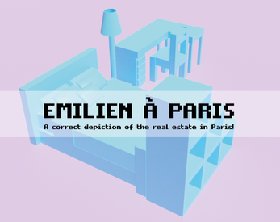

# Emilien in Paris
Created in **72H** for the **Ludum Dare 54** by [Bigaston](https://bigaston.itch.io) and [Nyeut](https://nyeut.itch.io)

Play as an interior designer in a correct depiction of the real estate in Paris!

You have to fullfill the needs of the your client but keep it simple! Your score is based on the number of space you left on the appartment. If at least two spaces are left empty near each other, you win some points. And the orange one is double!

Available on [itch.io](https://ilvegames.itch.io/emilien-in-paris)

